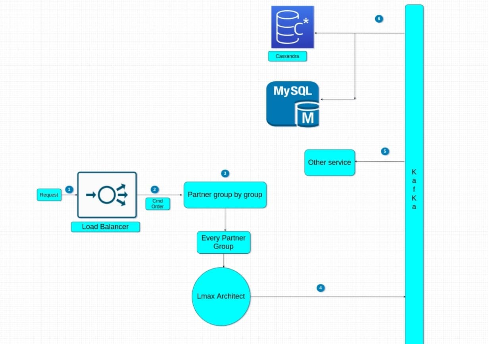

# HightPerformancePaymentGateway-BalanceServiceCommand

service balance for all partner, provider, end user, ...

- [Context](#Context)
- [Soluion](#Solution)
- [System design](#SystemDesign)

## Context 

Service Balance handle balancer of amount, plus, reduction, check amount valid. Service hasn't much partner but race
conditions is very large. One partner maybe have many users. Let's say we have several thousand partners globally but we
have several billion users in the world. Race conditions partner's balance is very large. Assuming the amount of RPS is
20 M. This is over the capacity of the DB, even in the case of sharding, because the number of partners is not large but
the race conditions are very large.  
We solved the problem and scale horizon service.  

## Soluion 

We use divide and conquer and LMAX architecture.  
We group partner to many group. Every group has one LMAX service. We push request of one group to one LMAX service
mapping respectively. We can infinitely scale the inventory, or balance problem.  

About LMAX architecture, has detail in link: https://martinfowler.com/articles/lmax.html

## System design 

1) Request to WAF to LB  
2) Request Service group By Partner  
3) Request To LMAX architect matching and response with status pending  
4) Result of LMAX will publish to Kafka  
5) and 6) Corresponding services and DB subscribe kafka and update status  

Note: To scale out this service, we don't keep status request's order. This is a bottleneck. Ex: 1000 requests in step
1, but 1000 requests in step 4 may have a different order. As the realtime system is very fast, this is not necessary
for us. Even if person A requests 0.01 ms before person B, but requesting person B to the server first, it will be
handled first, and person A may not be able to buy goods. This is accepted by us with a very small tolerance, there will
be no bad user experience.  

