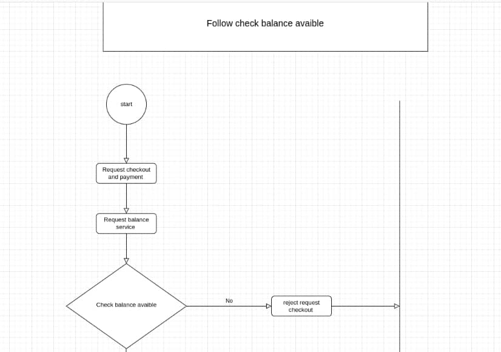
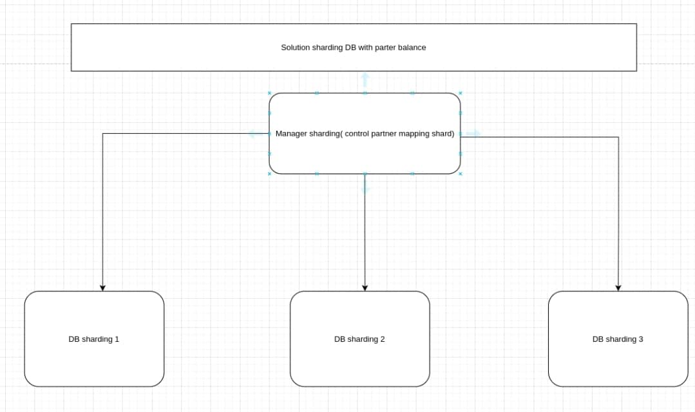
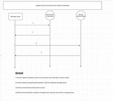
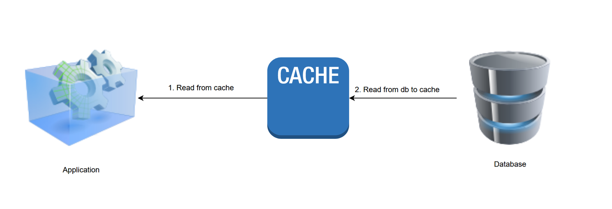
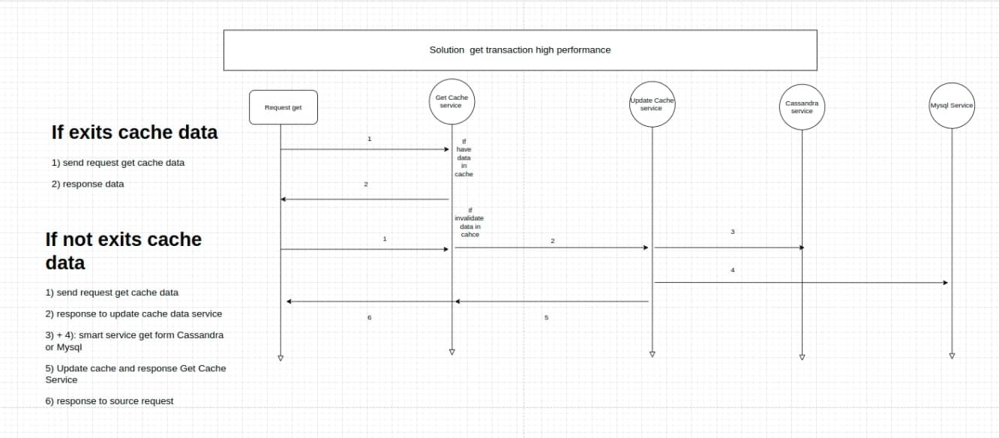
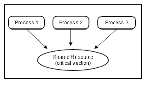
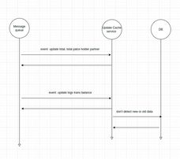
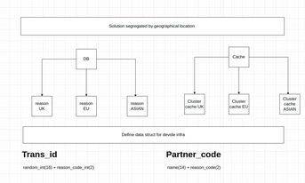
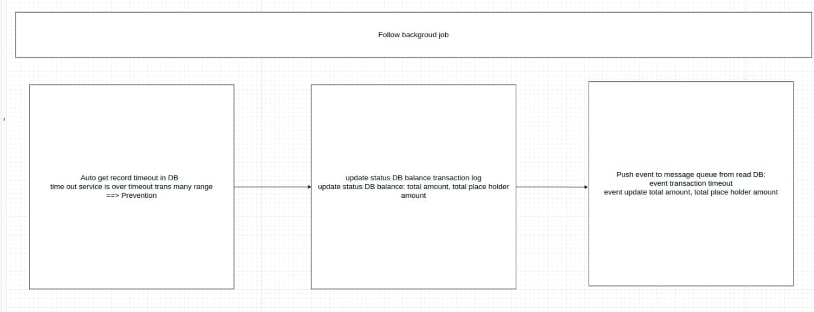

# HightPerformancePaymentGateway-BalanceService
service balance for all partner, provider, end user, ...

- [Review characteristics balance service in payment gateway](#ReviewCharacteristicsBalanceServiceInPaymentGateway)
- [System design service balancer handle several billion transaction per day](#SystemDesignServiceBalancerHandleSeveralBillionTransactionPerDay)
  - [Link all chart](#LinkAllChart)
  - [Follow check balance avaible](#FollowCheckBalanceAvaible)
  - [When use this follow?](#WhenUseThisFollow)
  - [Bottleneck](#Bottleneck)
  - [Solution](#Solution)
  - [Detail solution](#DetailSolution)
  - [Why i don't use auto sharding](#WhyIDontUseAutoSharding)
  - [Expansion sharding for e-wallet problem](#ExpansionForEWalletProblem)
    - [Problem](#Problem)
    - [Bottleneck](#Bottleneck)
    - [Solution](#Solution)
  - [Save data](#ProblemSaveData)
    - [Problem save data](#ProblemSaveData)
    - [Solution save data](#SolutionSaveData)
    - [Detail solution save data](#DetailSolutionSaveData)
    - [Solution high speed update balance](#SolutionHighSpeedUpdateBalance)
    - [Detail process handle](#DetailProcessHandle)
    - [Solution roolback after crash](#SolutionRoolbackAfterCrash)

  - [Get Data Trans](#GetDataTrans)
    - [Problem get data trans](#ProblemGetDataTrans)
    - [Solution get data trans](#SolutionGetDataTrans)

- [System design system get data for several billion user](#SystemDesignSystemGetDataForSeveralBillionUser)
  - [Problem system high get data](#ProblemSystemHighGetData)
    - [Problem high qps for io DB](#ProblemHighQpsForIoDB)
    - [Problem overload request to DB when invalidate cache](#ProblemOverloadRequestToDBWhenInvalidateCache)
  - [Solution system high get data](#SolutionSystemHighGetData)
    - [Solution get from cache](#SolutionGetFromCache)
    - [Solution update cache](#SolutionUpdateCache)
    - [Solution only handle one request update cache for one key in race conditions](#SolutionOnlyHandleOneRequestUpdateCacheForOneKeyInRaceConditions)
    - [Solution smart select DB](#SolutionSmartSelectDB)
  - [Solution update cache from message queue](#SolutionUpdateCacheFromMessageQueue)
  - [Solution detect new or old data from message queue](#SolutionDetectNewOrOldDataFromMessageQueue)

- [System divide infra by region](#SystemDivideInfraByRegion)
- [Problem divide infra by region](#ProblemDivideInfraByRegion)
  - [Problem DB divide infra by region](#ProblemDBivideInfraByRegion)
  - [Problem cache divide infra by region](#ProblemCacheivideInfraByRegion)
- [Solution divide infra by region](#SolutionDivideInfraByRegion)
  - [Solution DB divide infra by region](#SolutionDBivideInfraByRegion)
  - [Solution cache divide infra by region](#SolutionCacheivideInfraByRegion)
- [Service cache is independence between services and region](#ServiceCacheIsIndependenceBetweenServicesAndRegion)

- [System load smart traffic balancer](#SystemSmartTrafficLoadbalancer)
- [System rate limit](#SystemRateLimit)

- [Background job check balance session timeout](#BackgroundJobCheckBalanceSessionTimeout)
  - [The principle of job separation so that no lock is required?](#ThePrincipleOfJobSeparationSoThatNoLockIsRequired?)
  - [Action isolation principle?](#ActionIsolationPrinciple)

## Review characteristics balance service in payment gateway 
The balance service at payment gateways and e-wallets in general has several characteristics:  
1) Payment model is a hierarchical model, the top level payment will manage its child payment, its child payment will manage the payment grandchildren, .... so on to the enduser.  

2) Service balance will have to work with alternative payment models that require checking the partner balance before paying, most commonly found in the ebill model, with the service without balance checking, the cash flow has been circulated from the enduser to the bank.  

3) Due to the decentralized model, each payment usually has a small number of direct child partners, usually less than 10,000 partners. This feature determines how the DB is selected.  

4) Service balance requires extremely strict ACID. Every mistake costs a great deal of money.  

## Link all chart 

## Follow check balance avaible  

## When use this follow? 
Follow is extended to payment services that need to check partner balances before making payments.  

## Bottleneck 
When I want the system to handle several billion transactions per day, bottlenecks appear at many points, often points where cannot be scale horizon  .  

Specifically: Those are IO operations: check balance, create transaction, update total amount.  

I done one research mysql benmark:  
Detail, with a single row insert command, mysql can insert about 3300 to 3600 rows/second.  
With the update to one row command, mysql can execute about 600 to 900 qps commands.  
With the update and lock for update to one row command, mysql can execute about 250 to 350 qps commands.  

This number is extremely small with billions of users. We need a solution that can scale horizon or faster than this tens, hundreds of times.  
## Solution 

Solution:  
There are many solutions to this problem, the most common are:  
1) No blocking with Architecture LMAX  
2) DB sql scale horizon  

I chose solution 2. The reasons I chose it:

1) As you can see, the peculiarity of data balance is strict ACID. The payment of IO race conditions is inevitable. I was looking at several locking solutions: Redlock, lockDB, locking an instanse cache, I decided to go with the lockDB and sharding DB solution. I want to take full advantage of sql's integrity mechanism and system sql design of sharding to be able to have horizontal performance.  

2) Mysql(sql) is so famous and stable, it has reached the point of nice in terms of practical application technology. It is mature, stable and powerful.  

3) The cost of a sharding node is very small compared to its business scalability.  

## Detail solution 
Characteristics of the number of partners < 10000 (this is a very large number, I need 2 parts).  
1) Part one is the part of managing partner sharding, it will regulate and manage which partners + region exist on which sharding  
2) Part two is the sharding data part, it will shard and contain balance partner information. Struct DB sharding requires enough basic fields, extension does not edit fields and adds data and extended json objects. This is an important thing with manual sharding systems.  
3) Bottleneck about updating balance partner, I absolutely do not update to DB and do not use DB lock. The DB can only handle a small number of requests. I describe this issue in detail below.  

## Why i don't use auto sharding 

I have reference some tools for auto sharding mysql like Vitess. It offers a lot of automated and convenient features. I ask myself, should I use it?  

Re-survey the feature I need, it's quite simple, including control partner sharding and creating sharding, the feature that needs to be automated is not too much. When I manually shard, I can control almost everything, every query, move partner to other shard. I won't be attached to a other layer of tool auto sharding anymore. After considering the problem, I chose manual sharding.  

## Expansion sharding for e-wallet problem 
## Problem 
The problem is similar to the payment gateway, with a slight difference. With e-wallets, the object is a user, not a partner. The number of users can be up to several hundred million, but the number of payments of a user is several tens of thousands of times smaller than that of a partner.  

## Bottleneck 
Same with payment gateway  
## Solution  
Same with payment gateway  

## Save data  
## Problem save data 
With a number of several billion transactions a day, long-term data storage on mysql is a utopia. Even if mysql is available, it is not easy to ensure stable query and operation of mysql.  
## Solution save data 
The key here is that I need mysql to be lightweight to ensure system performance. The queries with the balance information of the success order are usually simple queries, do not require complex aggregation, I choose Cassandra DB for the solution. Cassandra is a distributed DB, it is born to serve huge storage needs with extremely high read threshold and simple queries.

## Detail solution save data 

## Solution high speed update balance 
1) possible amount = amount - placeholder amount  
   We will only work on the amount placeholder and update the amount only when necessary.  

2) Each balance check command will be executed entirely on the cache and ram. I calculate by updating the placeholder count, to the threshold from 0 to the amount. The entire amount of data will be cached and calculated. I use redis lock to lock if two commands interact with a partner balance.  

3) Cache is an ACID store not guaranteed, I need a solution for this. The system needs to be designed to ensure fast, rigorous ACID, so that it can handle recovery after cache or service failure. The system must absolutely guarantee that no transactions are miscalculated. There are two solutions to consider: use a message queue to store logs or use a DB to store logs.  

Here, each balance check or update order is inserted in a row to write the balance. This panel will be shard to ensure the horizon scale. Again, I use mysql's strong point of ACID and stability, durability, and fault tolerance. With an extremely high load and error data recovery system, I chose mysql sharding.  

4) The Redis key in step 2 is a very high performance key, several hundred thousand qps, but it is not 100% atomic. When the server cache crashes, the key can be lost, but this is not so important. I will always make sure the insert succeeds in step 3 to give the user feedback. If the insert in step 3 fails, we restore the placeholder count and issue a warning.  

5) Overall in this solution I use compute in ram, cache to increase performance and add log inserts in mysql for integrity. The combination of ram + redis + mysql sharding is the key to this solution.  

## Detail process handle 
1) Reset all variables of remote cache, load partner balance information from DB to remote cache  
2) Load transaction not success information from logs to get the amount place holder. (All transactions stored in balance logs are processed trans) and stored in remote cache  
3) Server handle requests will be pending until all data loads are done in cache.  
4) Once we have the latest information, we begin to calculate and process it as normal.  
5) I left open the solution to move data from remote cache to cache local in memory for computation. Maybe in the future, I will use it to further optimize the calculation speed.  
6) Every time a partner has place holder amount = total amount in DB, I will block that partner. A block variable will be set and released only when there is a change in the partner balance.
7) When there is an order from the message queue with success, the total amount will be reduced, updating the warehouse status to success. When the total amount is reduced, there will be an event that fires with the reduced amount for order xyz status. At this time, the service handle transaction logs balance receiving this event will move the status order through MoveCassandra. All orders here will be shipped via Cassandra.  
## Solution roolback after crash 

Of course, I have to keep this to a minimum. But, unfortunately it happens, we need a way to deal with it.  

Every time there is a crash, our job is to reload the system solutions. We have to make sure our running process is the same as the one running at crash. In other words, we don't need other proccess to when crashes, but the system is just like reloading data after restarting. <specific process>  

## System design system get data for several billion user 
A system that pays api get data for billions of users is a difficult system, has many problems and needs to be calculated from an overview to meticulously each problem for the system to work stably. I will dissect each problem encountered and the solution in the following section.  

## Problem system high get data 
## Problem high qps for io DB 
With billions of users online and getting data, the amount of qps can exceed the processing capacity of any DB, which is the first problem with most high-load systems.  

## Problem overload request to DB when invalidate cache 

With  data cache, when a cache invalidate, the common solution is to get and update the cache. At the breaking load threshold, this is fine. But at high load thresholds, there are cache keys that can make a large number of requests to a DB in a short time (until a new cache is available). It is DB overload.  

This is easy to imagine when you have 10000 get commands almost simultaneously into 1 key cache, at the same time that key cache invalidate. If handled in the usual way, you will almost have 10000 requests to the DB at the same time.  

## Solution system high get data 
## Solution get from cache 

In general, with billions of users and extremely large rqs, it is almost very limited to interact directly with the DB. Here, the receive will be taken from the cache.  

There exist 2 cases:
1) Data exist in cahce, get data and response  
2) Data not exits, call to update service and return the result.  

## Solution update cache 
Service update cache must ensure: there are 1000 requests to update cache with the same cache key at the same time, only process one request, only perform 1 process query to DB and update cache and return data for that request. Other requests will have to wait until the next query.  

In this problem, the number of race conditions is not large. With a large number of race conditions, service get cache and service update cache must be isolated. They just transmit data to each other via the message queue.  

## Solution only handle one request update cache for one key in race conditions 

I use mutext lock redis to handle it. With n update cache requests with 1 cache key, the first request to be handled will get the mutex and update the cache and return the result. Other requests will wait until the next update to get the latest results (at this point the cache is valid and the lock is also released).  

## Solution smart select DB 
I have designed:  order, log, balance DB success to be moved from mysql to cassandra. Besides, Cassandra has much better load capacity with mysql. The solution is simply to always prioritize the query in cassandra first, if not exists, switch the query to mysql.  

## Solution update cache from message queue 

Service listen even from DB change amount balance, amount balance place, update log to update cache respectively.

## Solution detect new or old data from message queue 
All columns in the DB have a column containing the timestand for created_at and updated_at, for each request in the message, always include updated_at time.  
1) If updated_at event > updated_at in cache, update new cache.  
2) If updated_at event < updated_at in cache, skip this event  
3) If updated_at event = updated_at in cache, it is not possible to detect whether this request is new or old. Simple solution, take the initiative to get from the DB and get the latest request.  

## System divide infra by region 
With a system of billions of users around the world, if there is only 1 data center, it will be a bottleneck, a whole server around the world must request to it. Even if the database bottleneck is solved, the servers in Vietnam have to go halfway around the ground to get a response from the US data center, which is a slow.  

## Problem divide infra by region 
The division of data by region is a wing used by many parties. However, this subdivision will have some merge data problems, data distribution problems. Must really understand the specifics of the business to be able to decide to split the data in accordance with the characteristics of the system.  

## Problem cache divide infra by region 
Cache is also an object that should be broken down by region for optimal speed. However, cache is less of a challenge and more difficult than splitting the DB.  

## Solution divide infra by region 
## Solution DB divide infra by region 

A survey on the characteristics of data payment getway: The data that needs to be broken down will be blocked with transId and partnerId. The data about config, setup partner is not much and does not have a large change frequency, the need to split by region is not high.  

I let each partner choose 1 of 3 regions (US, EU, ASIA). All order information, logs, balance, ... related to that partner order will be saved in the data center with the corresponding region.  

There will be some partners with a global customer base. They can have the option of multil partner, each order will be saved according to the region they want. If they are really big, they will have 3 independent information storage regions, all their reports and statistics will be independent according to those 3 regions.  

For high speed querying and easy routing, each order identifier must clearly state which region it is in. The rules for this are clearly shown in the figure above.  

## Solution cache divide infra by region 
The cache is also divided into independent regions just like the DB. All order cache information in the US region will be stored in the US cache.  

## Service cache is independence between services and region 

For cache, there will be less problems than DB. This division by region also ensures that when one cluster fails, the other clusters still operate normally, improving the system's fault tolerance.  

Service cache is independence between services and region

## System load smart traffic balancer 
I build a smart traffic system, it takes the user to the nearest server and is running stably to handle the request. The nodes or node clusters that have problems will be isolated from the system and handled  

The foundation of this system:  
Software define network + L4LB + L7LB + application backend  

## System rate limit 
Rate limit is a job with very simple logic but to have a good rate limit is not simple. A good rate limit is that the system, in addition to running the right features, also has an extremely high load capacity, most importantly when the request exceeds the system's processing threshold, absolutely no requests are allowed to enter the server. It will be sent into a black hole and destroyed in vain. Building such a system takes a lot of resources. A famous system can be said as the rate limit system of Cloudflare, AWS. I consider using these 3rd parties for rate limit.  

## Background job check balance session timeout 

When the system is stable, you will rarely see this job running. This job is generated in case of abnormality leading to transaction timeout. If this job is too much, the processing system is having problems, please check and investigate it.  
## The principle of job separation so that no lock is required? 
Avoid using lock as much as possible, a job will work with a shark, it gets all trans timeout in one day. Because the number of design jobs is not much, there is no need for too many workers to run.  

## Action isolation principle? 
The job will not perform updates to the DB, it does one thing is to detect the transaction time. Everything ends. It then fires even to the message queue about transaction timeout detection, service update trans and service move trans via cassandra will do that.  

If jobs do this, imagine there are 10 or 30 jobs, they are all edited directly into the DB. Oh, a pot of overlapping logic that you work so hard to debug. Let it be as independent as possible.  
