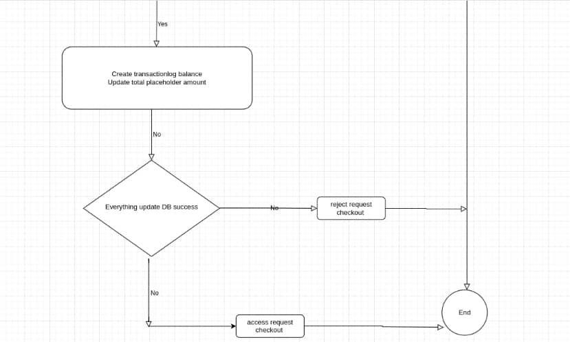

# HightPerformancePaymentGateway-BalanceService
service balance for all partner, provider, end user, ...

- [Review characteristics balance service in payment gateway](#ReviewCharacteristicsBalanceServiceInPaymentGateway)
- [System design service balancer handle several billion transaction per day](#SystemDesignServiceBalancerHandleSeveralBillionTransactionPerDay)
  - [Link all chart](#LinkAllChart)
  - [Follow check balance avaible](#FollowCheckBalanceAvaible)
  - [When use this follow?](#WhenUseThisFollow)
  - [Bottleneck](#Bottleneck)
  - [Solution](#Solution)
  - [Detail solution](#DetailSolution)
  - [Why i don't use auto sharding](#WhyIDontUseAutoSharding)
  - [Expansion sharding for e-wallet problem](#ExpansionForEWalletProblem)
    - [Problem](#Problem)
    - [Bottleneck](#Bottleneck)
    - [Solution](#Solution)
  - [Save data](#ProblemSaveData)
    - [Problem save data](#ProblemSaveData)
    - [Solution save data](#SolutionSaveData)
    - [Detail solution save data](#DetailSolutionSaveData)

  - [Get Data Trans](#GetDataTrans)
    - [Problem get data trans](#ProblemGetDataTrans)
    - [Solution get data trans](#SolutionGetDataTrans)

## Review characteristics balance service in payment gateway 
The balance service at payment gateways and e-wallets in general has several characteristics:  
1) Payment model is a hierarchical model, the top level payment will manage its child payment, its child payment will manage the payment grandchildren, .... so on to the enduser.  

2) Service balance will have to work with alternative payment models that require checking the partner balance before paying, most commonly found in the ebill model, with the service without balance checking, the cash flow has been circulated from the enduser to the bank.  

3) Due to the decentralized model, each payment usually has a small number of direct child partners, usually less than 10,000 partners. This feature determines how the DB is selected.  

4) Service balance requires extremely strict ACID. Every mistake costs a great deal of money.  

## Link all chart 

## Follow check balance avaible  

## When use this follow? 
Follow is extended to payment services that need to check partner balances before making payments.  

## Bottleneck 
When I want the system to handle several billion transactions per day, bottlenecks appear at many points, often points where cannot be scale horizon  .  

Specifically: Those are IO operations: check balance, create transaction, update total amount.  

## Solution 

Solution:  
There are many solutions to this problem, the most common are:  
1) No blocking with Architecture LMAX  
2) DB sql scale horizon  

I chose solution 2. The reasons I chose it:

1) As you can see, the peculiarity of data balance is strict ACID. The payment of IO race conditions is inevitable. I was looking at several locking solutions: Redlock, lockDB, locking an instanse cache, I decided to go with the lockDB and sharding DB solution. I want to take full advantage of sql's integrity mechanism and system sql design of sharding to be able to have horizontal performance.  

2) Mysql(sql) is so famous and stable, it has reached the point of nice in terms of practical application technology. It is mature, stable and powerful.  

3) The cost of a sharding node is very small compared to its business scalability.  

## Detail solution 
Characteristics of the number of partners < 10000 (this is a very large number, I need 2 parts).  
1) Part one is the part of managing partner sharding, it will regulate and manage which partners exist on which sharding  
2) Part two is the sharding data part, it will shard and contain balance partner information. Struct DB sharding requires enough basic fields, extension does not edit fields and adds data and extended json objects. This is an important thing with manual sharding systems.  

## Why i don't use auto sharding 

I have reference some tools for auto sharding mysql like Vitess. It offers a lot of automated and convenient features. I ask myself, should I use it?  

Re-survey the feature I need, it's quite simple, including control partner sharding and creating sharding, the feature that needs to be automated is not too much. When I manually shard, I can control almost everything, every query, move partner to other shard. I won't be attached to a other layer of tool auto sharding anymore. After considering the problem, I chose manual sharding.  

## Expansion sharding for e-wallet problem 
## Problem 
The problem is similar to the payment gateway, with a slight difference. With e-wallets, the object is a user, not a partner. The number of users can be up to several hundred million, but the number of payments of a user is several tens of thousands of times smaller than that of a partner.  

## Bottleneck 
Same with payment gateway  
## Solution  
Same with payment gateway  

## Save data  
## Problem save data 
With a number of several billion transactions a day, long-term data storage on mysql is a utopia. Even if mysql is available, it is not easy to ensure stable query and operation of mysql.  
## Solution save data 
The key here is that I need mysql to be lightweight to ensure system performance. The queries with the balance information of the success order are usually simple queries, do not require complex aggregation, I choose Cassandra DB for the solution. Cassandra is a distributed DB, it is born to serve huge storage needs with extremely high read threshold and simple queries.

## Detail solution save data 

